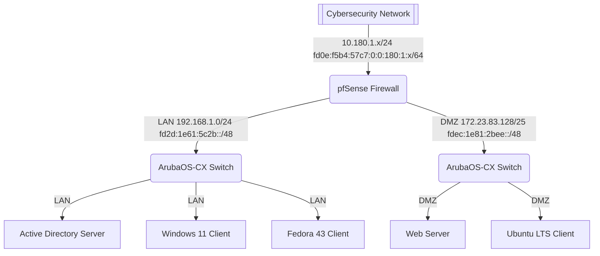

# Current Feature Goal

## Lab Scenario

- Every student in a course will get an identical lab to work on
- Each "lab" is an entirely separate network who's WAN connection is on our main network in a subnet (say, 10.180.1.0/24)

### Lab Network Structure

- Each lab gets a firewall VM (pfSense) with three interfaces:
    - WAN
    - LAN
    - DMZ
- There will be two virtual network switches (ArubaOS-CX Simulation Software):
    - One for the LAN interface
    - One for the DMZ interface
    - Switches will have a management interface that goes on the LAN interface
    - Uplink goes back to pfSense
- There will be five "important devices" in each lab
    - A server VM on LAN (MS AD)
    - A client VM on LAN (Windows 11)
    - A client VM on LAN (Fedora 43)
    - A server VM on DMZ (Web Server, needs to be accessible from the internet)
    - A client VM on DMZ (Ubuntu LTS)

### Tasks Summary

0. Discovery: Understand the current network setup and identify all devices and connections within the lab environment
1. Lock down firewall
2. Configure VLANs on firewall & switches
3. Configure management VLAN such that only the Fedora VM can access the switches management interfaces
4. Join the Windows 11 client VM to the Active Directory domain
5. Upgrade the Fedora 43 client VM to the latest version (44 as of now)
5. Configure the Web Server in the DMZ to be accessible from the internet
6. Ensure proper network segmentation and security policies are in place for all VLANs and interfaces
7. Add IPv6 support to the DMZ network
8. HONORS/Optional: Survive automated attacks (DDoS, Web Server exploitation, Trying to find open ports, Logons to (incorrectly) open servers)

### Network Diagram in Mermaid

## Strategy

- Terraform will be used to create the lab environment, including the pfSense firewall, switches, and all VMs. (workflow when deployed)
- Ansible will be used to configure all the devices, including the firewall, switches, and VMs. (workflow after terraform)
- Grading automation can be done using Ansible (aka a workflow triggered on resources manually)
- Students can view virtual console through this platform, and can power manage the things in their lab
- Arbitrary group permissions so maybe each lab belongs to a group and a group can have from 1 to N students